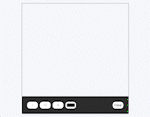

# About

This application is about a drawing tool created by HTML 5 canvas, using the canvas element for drawing and JavaScript API to draw lines in this particular app. Also, there are some "controls" like a clear button to clear the page, some buttons to adjust the thickness of the line, and a selected desired colour button.
I had lots of learning and fun project.

## Canvas API

The API used on the application is from [Canvas API](https://developer.mozilla.org/en-US/docs/Web/API/Canvas_API.)

## Application Preview

